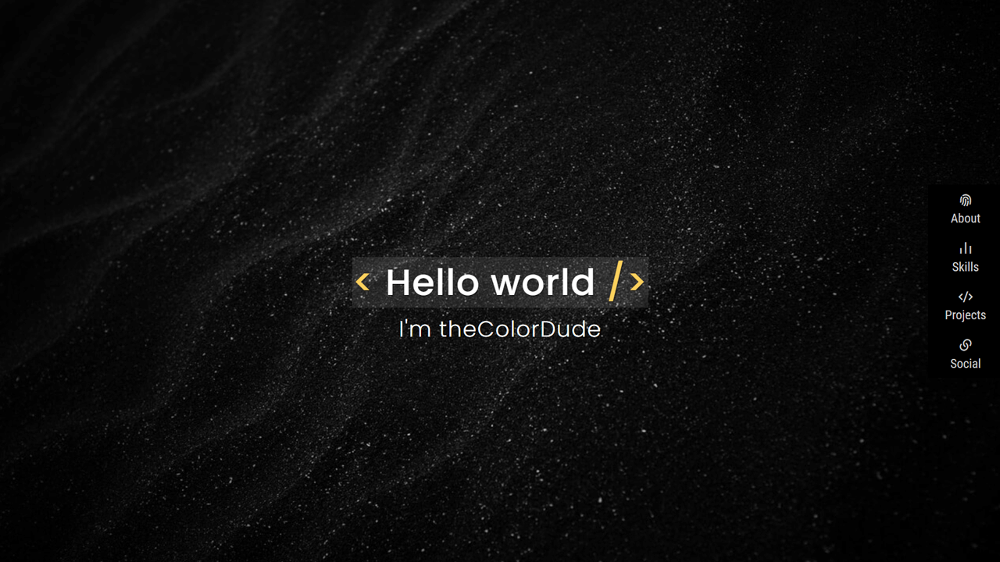

#  Tribute Page

[Live Demo](https://constpardalos.github.io/personal-portfolio-project/)

## Description

This is an assignment project from [freeCodeCamp.org](https://www.freecodecamp.org/).

The goal of this project is to create a personal portfolio page using HTML, CSS and JavaScript if needed.
The end result should fulfill all the user stories specified in the [project's description](https://www.freecodecamp.org/learn/responsive-web-design/responsive-web-design-projects/build-a-personal-portfolio-webpage).

## Resources

* Icon Web Font by [Remix Icon](https://remixicon.com/)
* Main background image from [unsplash.com](https://unsplash.com/photos/RCAhiGJsUUE)
* Social background image from [unsplash.com](https://unsplash.com/photos/8xznAGy4HcY)
